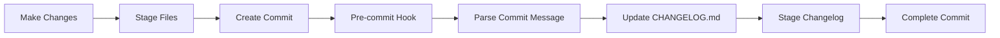

# Changelog & Commit Guide

A comprehensive guide for creating conventional commits and maintaining the project changelog in Mbx OS.

## Table of Contents

1. [Overview](#overview)
2. [Automated Changelog System](#automated-changelog-system)
3. [Conventional Commit Format](#conventional-commit-format)
4. [Commit Types](#commit-types)
5. [Quick Start](#quick-start)
6. [Manual Workflow](#manual-workflow)
7. [Release Management](#release-management)
8. [Configuration](#configuration)
9. [Best Practices](#best-practices)
10. [Examples](#examples)
11. [Troubleshooting](#troubleshooting)

## Overview

Mbx OS uses an **automated changelog system** that generates changelog entries based on conventional commit messages. This ensures:

- ✅ **Consistent formatting** across all changelog entries
- ✅ **Automatic categorization** of changes (Added, Fixed, Changed, etc.)
- ✅ **Version management** with semantic versioning
- ✅ **Team collaboration** with standardized commit messages
- ✅ **Professional documentation** for releases

## Automated Changelog System

### 🔧 **System Components**

1. **Pre-commit Hook** (`.githooks/pre-commit`) - Runs automatically before each commit
2. **Changelog Generator** (`scripts/update-changelog.js`) - Processes commit messages
3. **Configuration** (`changelog.config.js`) - Defines commit type mappings
4. **Commit Helper** (`scripts/commit-helper.sh`) - Interactive commit creation

### 🚀 **How It Works**



1. **Developer makes changes** and stages them
2. **Commits with conventional message** format
3. **Pre-commit hook** automatically runs
4. **Commit message is parsed** for conventional patterns
5. **Changelog is updated** with appropriate entry
6. **Updated changelog is staged** and included in commit

## Conventional Commit Format

### 📝 **Basic Structure**

```
<type>[optional scope]: <description>

[optional body]

[optional footer(s)]
```

### 🎯 **Components**

- **Type**: The kind of change (feat, fix, docs, etc.)
- **Scope**: Optional context (auth, ui, api, etc.)
- **Description**: Brief description of the change
- **Body**: Optional detailed explanation
- **Footer**: Optional metadata (breaking changes, etc.)

### ✨ **Examples**

```bash
# Basic feature
feat: add user authentication

# Feature with scope
feat(auth): implement OAuth login

# Bug fix
fix: resolve calculator division by zero

# Breaking change
feat!: redesign navigation API

# With body and footer
feat(ui): add dark mode toggle

Implement system-wide dark mode with user preference persistence.

BREAKING CHANGE: Theme configuration format has changed
```

## Commit Types

### 🏷️ **Available Types**

| Type       | Icon | Section | Description              | Version Impact |
| ---------- | ---- | ------- | ------------------------ | -------------- |
| `feat`     | ✨   | Added   | New features             | Minor          |
| `fix`      | 🐛   | Fixed   | Bug fixes                | Patch          |
| `docs`     | 📚   | Changed | Documentation            | None           |
| `style`    | 💄   | Changed | Code style (formatting)  | None           |
| `refactor` | ♻️   | Changed | Code refactoring         | None           |
| `perf`     | ⚡   | Changed | Performance improvements | Patch          |
| `test`     | 🧪   | Changed | Test updates             | None           |
| `chore`    | 🔧   | Changed | Maintenance tasks        | None           |
| `ci`       | 👷   | Changed | CI/CD changes            | None           |
| `build`    | 📦   | Changed | Build system changes     | None           |

### 🚨 **Breaking Changes**

To indicate breaking changes, use:

- `feat!:` or `fix!:` (with exclamation mark)
- Include `BREAKING CHANGE:` in the footer

## Quick Start

### 🛠️ **Initial Setup**

1. **Configure Git hooks**:

```bash
bun run setup:hooks
```

2. **Verify setup**:

```bash
git config core.hooksPath
# Should show: .githooks
```

### 🚀 **Option 1: Interactive Commit Helper (Recommended)**

```bash
# 1. Make your changes
# 2. Stage the files
git add .

# 3. Use the interactive helper
bun run commit
# or
./scripts/commit-helper.sh
```

The helper will:

- ✅ Show you staged files
- ✅ Guide you through commit type selection
- ✅ Help format the message correctly
- ✅ Preview the commit before creation
- ✅ Automatically update the changelog

### ⚡ **Option 2: Manual Conventional Commits**

```bash
# Stage your changes
git add .

# Commit with conventional format
git commit -m "feat: add new dashboard widget"

# Changelog updates automatically!
```

### 🔧 **Option 3: Manual Changelog Update**

```bash
# Update changelog without committing
bun run changelog:update

# Or with specific commit message
node scripts/update-changelog.js "feat: add new feature"
```

## Manual Workflow

### 📋 **Step-by-Step Process**

1. **Make Changes**:

```bash
# Edit your files
code components/apps/MyNewApp.tsx
```

2. **Stage Changes**:

```bash
# Stage specific files
git add components/apps/MyNewApp.tsx

# Or stage all changes
git add .
```

3. **Check Status**:

```bash
git status
```

4. **Create Commit**:

```bash
# Option A: Use helper (recommended)
bun run commit

# Option B: Manual conventional commit
git commit -m "feat(apps): add new productivity app"
```

5. **Verify Changelog**:

```bash
# Check that changelog was updated
git diff HEAD~1 CHANGELOG.md
```

6. **Push Changes**:

```bash
git push origin main
```

## Release Management

### 🎯 **Creating New Releases**

The release system automatically moves unreleased changes to versioned sections and manages semantic versioning.

#### **🚀 Quick Release Commands**

```bash
# Patch release (bug fixes) - 1.0.0 → 1.0.1
bun run release:patch

# Minor release (new features) - 1.0.0 → 1.1.0
bun run release:minor

# Major release (breaking changes) - 1.0.0 → 2.0.0
bun run release:major

# Custom release with specific version
bun run release minor "1.5.0" "Special milestone release"
```

#### **📋 Release Process**

1. **Accumulate Changes**: Work normally, creating commits with conventional messages
2. **Review Unreleased**: Check the `[Unreleased]` section in CHANGELOG.md
3. **Create Release**: Run the appropriate release command
4. **Review & Commit**: Review generated changelog and commit the release
5. **Tag & Push**: Create git tags and push to remote

#### **🔄 Step-by-Step Release Workflow**

```bash
# 1. Check current unreleased changes
cat CHANGELOG.md | grep -A 20 "## \[Unreleased\]"

# 2. Create a new release (example: minor release)
npm run release:minor

# 3. Review the generated changelog
git diff --cached CHANGELOG.md

# 4. Commit the release
git commit -m "chore: release v1.3.0"

# 5. Create and push tags
git tag v1.3.0
git push origin main --tags
```

### 🏷️ **Release Types & Versioning**

| Release Type | Version Change  | When to Use                      | Example            |
| ------------ | --------------- | -------------------------------- | ------------------ |
| **Patch**    | `1.0.0 → 1.0.1` | Bug fixes, minor improvements    | Fix calculator bug |
| **Minor**    | `1.0.0 → 1.1.0` | New features, enhancements       | Add new app        |
| **Major**    | `1.0.0 → 2.0.0` | Breaking changes, major rewrites | API redesign       |

### 📝 **What Happens During Release**

1. **Version Calculation**: Automatically increments version based on type
2. **Changelog Update**: Moves unreleased changes to new version section
3. **Release Notes**: Generates summary based on changes
4. **Package Update**: Updates `package.json` version
5. **File Staging**: Stages all modified files for commit
6. **Public Copy**: Updates `public/CHANGELOG.md` for the Changelog app

### 🎨 **Release Notes Generation**

The system automatically generates release notes based on your changes:

```markdown
## [1.3.0] - 2025-08-07

### Feature-Rich Update

This minor release includes 5 changes with 2 new features, 1 bug fix, 2 improvements.
Enjoy the new features and enhanced functionality!

### Added

- ✨ Automated changelog generation system
- ✨ **apps**: Changelog viewer with search functionality

### Fixed

- 🐛 **ui**: Context menu positioning issue

### Changed

- 📚 Updated developer documentation
- 🔧 Improved build process
```

### ⚙️ **Custom Release Notes**

You can provide custom release notes:

```bash
# With custom release notes
npm run release minor "1.5.0" "🎉 Milestone Release

This special release marks a major milestone in Mbx OS development with
comprehensive changelog automation and enhanced developer experience."
```

### 🔍 **Pre-Release Checks**

Before creating a release, the system checks:

- ✅ **Unreleased changes exist**: Ensures there's content to release
- ✅ **Valid version format**: Validates semantic versioning
- ✅ **Git repository**: Confirms you're in a git repository
- ✅ **File permissions**: Checks write access to required files

### ⚙️ **Changelog Configuration**

Edit `changelog.config.js` to customize:

```javascript
module.exports = {
  // Automatic version release
  autoRelease: false, // Set to true for auto-versioning

  // Custom commit types
  types: {
    feat: {
      section: "Added",
      icon: "✨ ",
      description: "New features",
    },
    // ... more types
  },

  // Version bump rules
  versionRules: {
    major: ["feat"], // Breaking changes
    minor: ["feat"], // New features
    patch: ["fix", "perf"], // Bug fixes
    none: ["docs", "style", "refactor", "test", "chore"],
  },
};
```

### 🎛️ **Git Hook Configuration**

The pre-commit hook can be customized in `.githooks/pre-commit`:

```bash
#!/bin/sh
# Customize hook behavior here
echo "🔄 Running pre-commit hook..."

# Your custom logic
node scripts/update-changelog.js "$COMMIT_MSG"
```

## Best Practices

### ✅ **Do's**

1. **Use imperative mood**: "add feature" not "added feature"
2. **Keep descriptions concise**: Under 50 characters when possible
3. **Be specific**: "fix login validation" not "fix bug"
4. **Use appropriate types**: Choose the most accurate commit type
5. **Include scope when helpful**: `feat(auth): add OAuth`
6. **Document breaking changes**: Always include BREAKING CHANGE footer

### ❌ **Don'ts**

1. **Don't use generic messages**: Avoid "update", "changes", "fixes"
2. **Don't include periods**: No trailing dots in descriptions
3. **Don't mix multiple changes**: One logical change per commit
4. **Don't skip the type**: Always include a valid commit type
5. **Don't ignore breaking changes**: Always mark them appropriately

### 📝 **Message Quality Guidelines**

```bash
# ✅ Good examples
feat: add user dashboard
fix: resolve memory leak in file browser
docs: update API documentation
refactor: simplify authentication flow

# ❌ Poor examples
update stuff
fixed bug
changes
WIP
```

## Examples

### 🎯 **Real-World Examples**

#### **New Feature**

```bash
feat(apps): add changelog viewer app

Implement comprehensive changelog display with:
- Markdown parsing and rendering
- Search and filter functionality
- Version navigation
- Export capabilities
```

#### **Bug Fix**

```bash
fix(ui): resolve context menu positioning

Context menus now appear correctly when right-clicking
file items in the browser. Fixed event propagation issue
that caused menus to disappear immediately.
```

#### **Breaking Change**

```bash
feat(api)!: redesign file system interface

Simplify the virtual file system API for better performance
and consistency across apps.

BREAKING CHANGE: FileSystem.save() now returns Promise<void>
instead of boolean. Update all file operations accordingly.
```

#### **Documentation**

```bash
docs: add app development guide

Create comprehensive guide covering:
- Component architecture
- Window system integration
- File system usage
- Styling guidelines
```

#### **Performance Improvement**

```bash
perf(rendering): optimize window redraw performance

Implement virtual scrolling for large file lists and
reduce unnecessary re-renders in window management.
Improves performance by ~40% with 100+ open windows.
```

### 📊 **Changelog Output Examples**

These commits would generate changelog entries like:

```markdown
## [Unreleased]

### Added

- ✨ **apps**: Changelog viewer app with markdown parsing and search
- ✨ **api**: Redesigned file system interface (BREAKING CHANGE)

### Fixed

- 🐛 **ui**: Context menu positioning in file browser

### Changed

- ⚡ **rendering**: Optimized window redraw performance (~40% improvement)
- 📚 App development guide with comprehensive examples
```

## Troubleshooting

### 🔍 **Common Issues**

#### **1. Hook Not Running**

**Problem**: Changelog doesn't update automatically

**Solution**:

```bash
# Check hook configuration
git config core.hooksPath

# Should show: .githooks
# If not, run:
npm run setup:hooks

# Verify hook is executable
ls -la .githooks/pre-commit
# Should show: -rwxr-xr-x
```

#### **2. Node.js Not Found**

**Problem**: "Node.js not found" error in hook

**Solution**:

```bash
# Check Node.js installation
node --version

# If not installed, install Node.js
# Then verify the path in your shell
which node
```

#### **3. Commit Type Not Recognized**

**Problem**: "Unknown commit type" message

**Solution**:

```bash
# Check available types in changelog.config.js
cat changelog.config.js | grep -A 5 "types:"

# Use one of the defined types:
git commit -m "feat: your feature description"
```

#### **4. Changelog Format Issues**

**Problem**: Entries appear in wrong section

**Solution**:

```bash
# Manually run changelog update to test
npm run changelog:update

# Check configuration mapping
cat changelog.config.js
```

### 🛠️ **Debug Mode**

Enable debug output:

```bash
# Run changelog generator manually with debug
DEBUG=1 node scripts/update-changelog.js "feat: test feature"

# Check git hook output
git commit -m "feat: test" --verbose
```

### 🔄 **Resetting Changelog**

If you need to start fresh:

```bash
# Backup current changelog
cp CHANGELOG.md CHANGELOG.md.backup

# Reset to template
cat > CHANGELOG.md << 'EOF'
# Changelog

All notable changes to this project will be documented in this file.

The format is based on [Keep a Changelog](https://keepachangelog.com/en/1.0.0/),
and this project adheres to [Semantic Versioning](https://semver.org/spec/v2.0.0.html).

## [Unreleased]

EOF
```

### 📞 **Getting Help**

1. **Check the logs**: Look at git hook output during commit
2. **Test manually**: Run `npm run changelog:update` to test
3. **Review configuration**: Check `changelog.config.js` settings
4. **Verify setup**: Ensure hooks are properly configured

## Advanced Usage

### 🎯 **Custom Commit Types**

Add new commit types in `changelog.config.js`:

```javascript
types: {
  // Add custom type
  security: {
    section: 'Security',
    icon: '🔒 ',
    description: 'Security improvements'
  }
}
```

### 🚀 **Automatic Versioning**

Enable automatic version releases:

```javascript
// In changelog.config.js
module.exports = {
  autoRelease: true, // Enable auto-versioning
  // ...
};
```

### 📋 **Release Notes Templates**

Customize release note generation:

```javascript
releaseNotes: {
  minor: {
    template: 'This release introduces new features and improvements.',
    examples: [
      '## Highlights\n\nKey improvements in this release:'
    ]
  }
}
```

---

## Summary

The automated changelog system provides:

- 🤖 **Automatic changelog updates** from conventional commits
- 🎯 **Consistent formatting** across all entries
- 🚀 **Easy-to-use tools** for creating proper commits
- 📊 **Professional documentation** for releases
- 👥 **Team collaboration** with standardized practices

### **Quick Commands Reference**

```bash
# Setup (one-time)
npm run setup:hooks

# Daily workflow
git add .
npm run commit           # Interactive helper
# or
git commit -m "feat: add new feature"  # Manual

# Manual operations
npm run changelog:update  # Update changelog manually
```

Start using conventional commits today for better project documentation! 🎉

---

**Last Updated**: August 6, 2025  
**Version**: 1.0.0  
**Mbx OS Version**: 1.2.0
